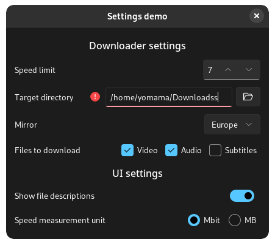
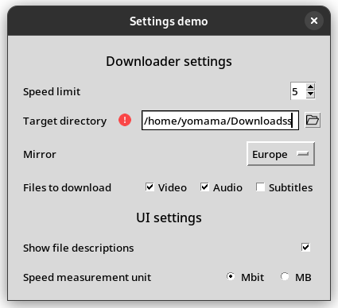

# object-settings

Simple-to-use object-oriented Python config library, where your settings are objects.

Their values have automatic validation and get saved to a file that's seamlessly
written and read in the background, so you don't have to worry about any of it. 
This makes it quick to define and use settings (see examples below).

Installation & usage
====================

This module is on PyPi, so you can just do `pip install object-settings`

After which it will be available with just the package name `settings`

    import settings
    settings.setup("Your app name")
    
    your_option1 = settings.Toggle("Your first option label")
    your_option2 = settings.Number("Your second option label")

Simple objects
==============

For example, you can set a font size at the top of your ui file:

    font = settings.Number(default=14)

    ...
    someuilib.Label("Bababooey", size=font.value)
    ...
    someuilib.Textbox("Lorem ipsum dolor...", font_size=font.value)
    ...

Or if a setting is only checked in one place, it can be used without defining a variable:

    if settings.Toggle("Update app automatically", default=True):
        # do update

(it doesn't matter if the same setting is initialized multiple times)

Integration
===========

The setting objects support "equals"-checking with actual values:

    speed = settings.Number("Speed limit", 5)
    
    print(speed == 5)
    >> True
    print(speed == 3)
    >> False

In addition, they work with many type-specific operations:

    for selection in settings.Multichoice():
        ...

    if settings.Toggle():
        ...

Automatic storing
=================

When a setting's value is read/set, object-settings automatically creates and updates 
a config file on the disk in the background. 
Any file deletions or unparsable external modifications are also handled.

By default, the files are saved to a standard config location, depending on the platform 
(uses [appdirs](https://github.com/ActiveState/appdirs) package for paths). 
You can also set a custom directory for e.g. running in a Docker container.

Value validation
================

When a new value is set, it automatically gets validated and raises a `ValueError` if it doesn't pass.
This validation includes more than just datatypes, for example numbers can have min/max limits, 
or a path setting can be set to require an existing path.

Listen for changes
==================

If you have some update function that you want to be called when a setting is changed, 
you can add that function as a listener:

    some_setting.add_listener(your_function)

Now the function will be called every time when a new value is set.

Sections
========

Optionally, if you have a lot of settings, you can organize them into sections 
(which also works well with UIs)

    download_options = settings.Section("Downloader settings")
    speed = settings.Number("Speed limit", 5, section=download_options)
    dir = settings.Path("Target directory", '/home/yomama/Downloads', section=download_options)
    server = settings.Choice("Mirror", ["Europe", "Asia", "America", "Africa"], "Asia", section=download_options)

Did I mention free GUIs?
========================

That's right, this library also includes a separate `settings_gui` package that has 
pre-made settings menus for both tkinter and ttk, with GTK and others to come.
They have full integration with the aforementioned systems, like validation and sections.

Here's an example of some dummy settings with both libraries: 
(notice the warning for the misspelt download path)

<figure>
  
  <figcaption>Nice-looking ttk (theme: Sun Valley dark)</figcaption>
</figure>

<figure>
  
  <figcaption>Bare tkinter works too</figcaption>
</figure>

And you can get this automatically for all your defined settings by just calling one function! 
(`SettingsFrame` or `SettingsWindow`, depending on preference)

Or, if you want to get more custom/contextual, you can also use the individual 
setting widgets and place them around your app (submodule `type_frames`).

Setting types
=============

List of currently available setting types:

- Toggle (bool)
- Choice (str)  [from a list of options]
- Multichoice (list)  [of things from a list of options]
- Text (str)
- Path (str)
- Number (int)
